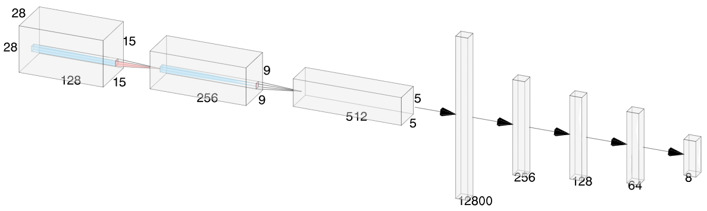
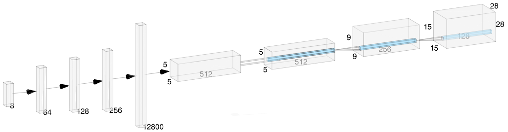
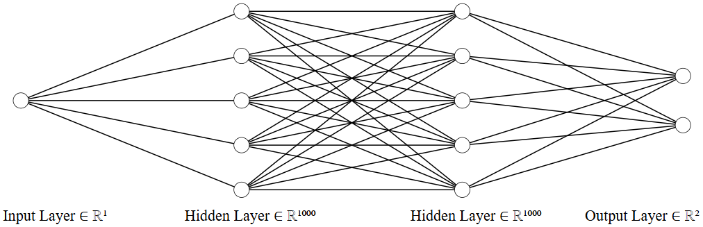
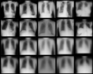
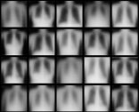
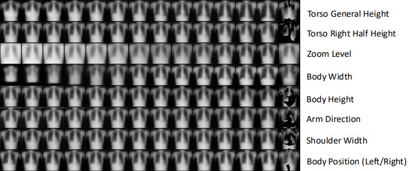
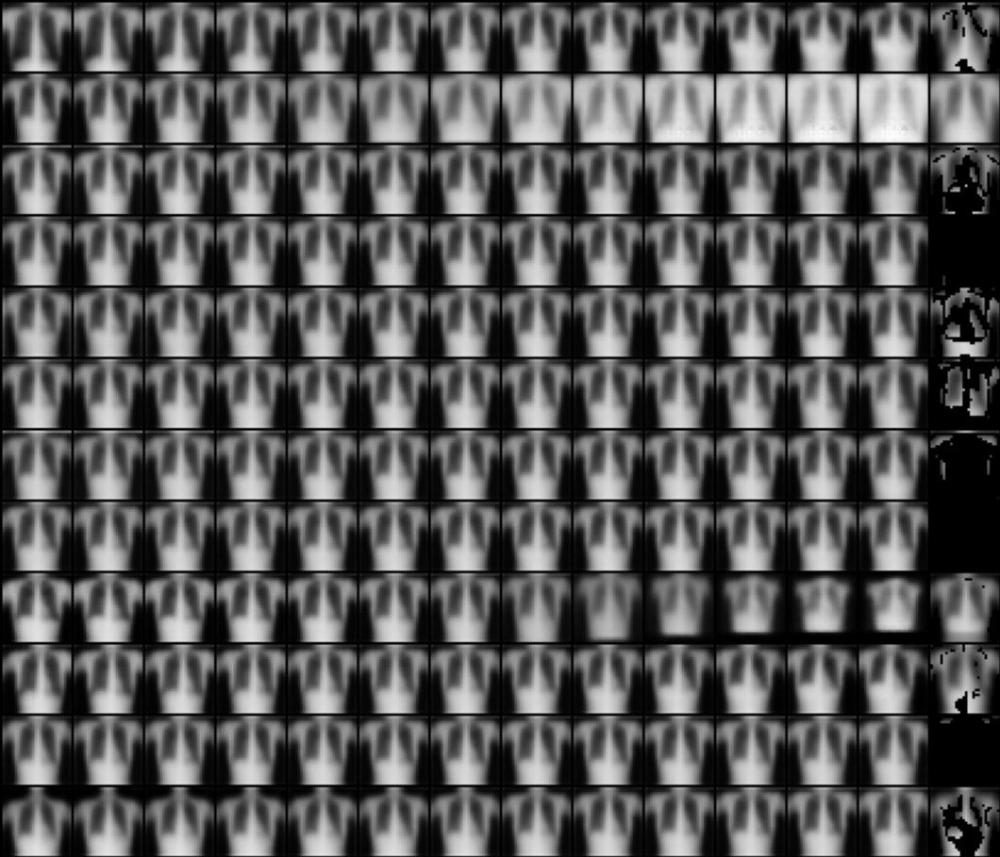

# A practical implementation of FactorVAE 
   

A PyTorch implementation of a variational autoencoder that achieving disentanglement through
the FactorVAE concept [[1]](#1). 
Trained on ChestMNIST (dataset of X-ray chest images) using PyTorch.

> A TU Darmstadt project by Elias Fiedler, Fynn Becker, Patrick Reidelbach.

## Table of Contents

- [Overview](#overview)
- [Model Architecture](#model-architecture)
- [Results](#results)
- [Future Improvements](#future-improvements)
- [Usage](#reproducibilityusage)
- [License](#license)
- [Citations](#citations)

## Overview

### VAE
A variational autoencoder consists of two neural networks. The encoder and the decoder.
The encoder converts an input image into a representation in a latent space. This latent space is of smaller dimension
compared to the input. Therefore, the encoder essentially compresses the input data.

The decoder attempts to replicate the input image from the latent space representation provided by the encoder.
It performs an action similar to decompression. By altering the latent space representation of an input image
or by randomly sampling from the latent space and passing the sample to the 
decoder new images can be generated using the decoder.

### Disentanglement
A traditional VAE uses the latent space in a way that is not understandable for humans. The dimensions of
the latent vector do not encode a single piece of information. Disentanglement refers to the model learning
a latent vector, where each dimension represents a single piece of interpretable information (e.g. shape, orientation, size).
This means each dimension controls a separate aspect of the image that can be adjusted independently of other aspects.

### FactorVAE
In their paper, Hyunjik Kim and Andriy Mnih [[1]](#1) propose a special type of VAE 
that achieves disentanglement by factorizing. The presented FactorVAE is an adversarial model consisting of a normal
VAE and a third neural network: The discriminator. 
During training, the discriminator receives a regular sample created by the encoder and a sample
where the order of the latent dimensions has been randomly permutated. It then attempts to classify these two samples.
Using the outcome of the classification the VAE is penalized based on how much the dimensions of the latent 
space are related to each other. This creates an incentive for the VAE to become more disentangled.

## Model Architecture
We used a latent vector dimension of $8$ and arrived at a model size of $\approx 48\space \text{mio}$ parameters.

The encoder uses 3 convolution layers, which generate $5x5$ feature maps from the $28x28$ input images.
The following dense layers are present twice in our network, each with independently trained weights. One is 
responsible for generating $\mu$, and one is reponsible for generating $\sigma$.
<p align="center">
    
    <br>
    <em>Architecture of our encoder.</em>
</p>

For exact reconstruction, we set $z=\mu$ (with $z$ being the latent vector). For training we arrive at the 
latent vector through reparameterization. The decoder uses $4$ transposed convolutions, the first one of which is producing
a $5x5$ output again.
<p align="center">
    
    <br>
    <em>Architecture of our decoder.</em>
</p>

The decoder is a network with $\approx 1\space \text{mio}$ parameters. The two outputs are the confidence for
'real' and permuted latent vectors, respectively.
<p align="center">
    
    <br>
    <em>Architecture of our discriminator.</em>
</p>

## Results
Reconstruction quality started to suffer when disentangling the model. This was partly solved
through a beta-annealing strategy, but can still be improved. Below, we have visualized 10 images from the dataset
(first two rows) and our model's replications (last two rows): 
<p align="center">  
    
    <br>
    <em>Reconstruction results.</em>
</p>

By randomly generating latent vectors, we are able to create synthetic images that were not present in the dataset.
Below, we have visualized a grid of 20 synthetic images generated by our model: 
<p align="center">  
    
    <br>
    <em>Synthetically generated images (random sample).</em>
</p>

We were able to achieve decent disentanglement in our model. Each dimension in the latent space encodes
an independent piece of interpretable information. The visualization below demonstrates the disentanglement.
The same picture is used as a baseline for each row. Then in each row only one dimension of the latent space is altered
by adding an offset, all the other dimensions remain untouched. The offset ranges from $-3$ to $3$ using an increment of 
$0.5$ from left to right in the table. The rightmost image is a difference
map, where the mean of all images is displayed and pixels that have not changed are discarded.\
Latent space: 
<p align="center">  
    
    <br>
    <em>Latent space with interpretations.</em>
</p>

Upon closer inspection, a specific characteristic that is changed throughout the images can be found for each row in
the visualization.

### Interesting Finds
Increasing the latent vector dimension just slightly to $12$ led to worse disentanglement and $4$ dimensions being unused.
This provides very clear insight into how large the latent vector needs to be for a specific dataset and model.

<p align="center">  
    
    <br>
    <em>Latent vector dimension is too high.</em>
</p>

As long as the model was still disentangled well enough, it was also interesting to see the model find the
same (or very similar) attributes in the data (dimensions in the latent vector), even when changing parameters
such as $\gamma$. This happened over and over again through many training sessions.

## Future improvements
The created images are still blurry, with additional training resources this can probably be improved.
Using a perceptual similarity metric (e.g. SSIM) for replicated images in the loss function would likely also be helpful.

## Reproducibility/Usage
To install required packages:
````
pip install -r requirements.txt
````
Please note that this does not install torch with CUDA support. If your machine supports CUDA, we strongly recommend using the CUDA enabled versions.

There are several ways to start the project. To train a model with your own parameters, use:
````
python main.py --mode train
````
When training is complete, a GIF will be saved to `project_root/gifs` with a reconstruction visualization from every
training epoch. Several metrics are logged to TensorBoard, which you can start as follows:
````
tensorboard --logdir [dir]
````

To evaluate a model by visualizing the latent vector or reconstruction quality, use:
````
python main.py --mode latent
python main.py --mode replicate
````

Lastly, to perform random sampling (i.e. generating synthetic images), use:
````
python main.py --mode random
````
A pre-trained model file ($\approx500\text{ MB}$) is available on GitHub Large File Storage. It uses the architecture and parameters present in the repository.
Please note that this is not the exact model used to generate the figures above, however, it will achieve similar
performance. To download the model, use the pointer file in the repository.

## License
This project is licensed under the [MIT License](LICENSE).

## Citations
<a id="1">[1]</a>: Hyunjik Kim and Andriy Mnih. *Disentangling by Factorising*. arXiv preprint arXiv:1802.05983, 2019. [https://arxiv.org/abs/1802.05983](https://arxiv.org/abs/1802.05983)
